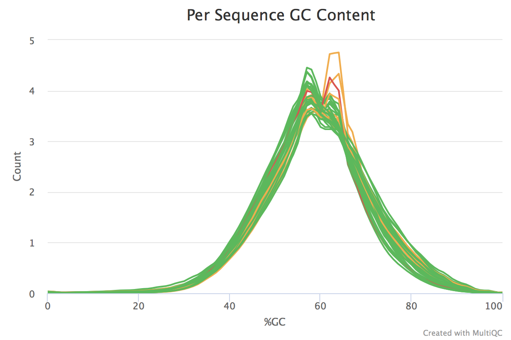

% Metagenomics in RNA Seq
% Andrew Skelton
% 2nd August 2017


#
## What exactly are you doing?
* "Wouldn't it be interesting if..." - David
* "Wouldn't it be cool if..." - Louise
* Hypothesis: Is there a difference in contamination between NOF and OA RNA Seq samples?
* Broad hypothesis, but presents some interesting challenges.


#
## I'm with you so far... What challenges?
* What to quantify?
* How to quantify it?
* What database could we use? ... is there a database?


#
## Lets start with data, what's the input?
* Fastq files - (raw sequencer reads with quality scores)
* First Pass: Unmapped reads from a 2-pass STAR alignment
* (to do) Second Pass: Mapped reads


# Quality Control

## Process
* fastqc on each sample
* MultiQC for experiment wide context
* Trim Galore for cleaning up data

## Trimming
```bash
#!/bin/bash
for i in ../raw_data/*R1*; do
	filename=$(basename "$i")
	filename="${filename%.*}"
	filename="${filename%.*}"
	filename="${filename%.*}"

	trim_galore --paired --illumina --phred64 -o ../trimming/ \
							../raw_data/${filename}.R1.fastq.gz \
							../raw_data/${filename}.R2.fastq.gz &
done
```

## Fastqc + Multiqc
```bash
for i in ../trimming/*.fq.gz; do
  fastqc -o ../fastqc/trimmed ${i} &
done
wait
multiqc ../fastqc/trimmed/
```

## How many reads left?
* Between 1 and 3 million paired reads per sample
* 15%-20% of sequence duplication per sample
* GC average ~56%
* Length average 55-60 bases

## GC Distribution



#
## We have data, now what?
* Quantification, and something to quantify against.
* There are a few potential methods
* 2 birds, one stone - Kraken.

#
## What's Kraken?


## Kraken in a nutshell
* Assigns Taxonomic labels to short DNA sequences (RNA compatible)
* Designed for metagenomic reads
* Really Really quick (1,441,476 Reads/Min)
* Comes with a pre-built database (~4GB)
* Containing Bacterial, Archaeal, and Viral Genomes
* Build - Refseq 2014
* Outputs in MPA format

## Code - Running Kraken
```bash
# Variables
KRAKEN=/home/andrew/2016May_RNASeq_David/Alignment_STAR/Unmapped/kraken/kraken_install/kraken
KRAKEN_T=/home/andrew/2016May_RNASeq_David/Alignment_STAR/Unmapped/kraken/kraken_install/kraken-translate
KRAKEN_DB=/home/andrew/2016May_RNASeq_David/Alignment_STAR/Unmapped/kraken/minikraken_20141208
INDIR=/home/andrew/2016May_RNASeq_David/Alignment_STAR/Unmapped/trimming
OUTDIR=/home/andrew/2016May_RNASeq_David/Alignment_STAR/Unmapped/kraken/kraken_out/

# Loop through forward read files
for i in ../trimming/*R1*.gz; do
  # Get sample name
	filename=$(basename "$i")
	filename="${filename%.*}"
	filename="${filename%.*}"
	filename="${filename%.*}"

  # Run Kraken
	$KRAKEN --db $KRAKEN_DB --threads 10 --fastq-input --gzip-compressed --quick \
					--output ${OUTDIR}/${filename}.kraken \
					--paired ${INDIR}/${filename}.R1_val_1.fq.gz \
	 							 ${INDIR}/${filename}.R2_val_2.fq.gz

  # Get Classified Entries
	grep "^C" ${OUTDIR}/${filename}.kraken > ${OUTDIR}/${filename}.classified.kraken

  # Annotate records with taxa info
	$KRAKEN_T --mpa-format \
            --db $KRAKEN_DB ${OUTDIR}/${filename}.classified.kraken > \
            ${OUTDIR}/${filename}.classified.kraken.mpa
done
```

## Some Numbers
  Reads     Classified   Proportion
---------- ------------ -------------
1,162,956	  9659	       0.83%
1,193,058	  10482	       0.88%
1,797,999	  11326	       0.63%
1,686,084	  10406	       0.62%
1,475,108	  11674	       0.79%
1,146,232	  12124	       1.06%
1,231,947	  14295	       1.16%
1,061,730	  17620	       1.66%
1,314,030	  11385	       0.87%
1,740,879	  17101	       0.98%
1,895,157	  13527	       0.71%
2,780,420	  15333	       0.55%
1,647,065	  13347	       0.81%
1,679,619	  12112	       0.72%
1,309,555	  14893	       1.14%
978,411	    12996	       1.33%

#
## Kraken Results
* How to quantify?
* How to analyse?
* Accounting for Taxa level?


## Step 1 - Setting things up
```R
pheno           <- read_tsv("NOF_OA_Pheno_Table.txt")
Kingdom         <- c(); Phylum <- c(); Class   <- c(); Order <- c();
Family          <- c(); Genus  <- c(); Species <- c();
files.in        <- list.files("kraken_out/", pattern = "*.mpa", full.names = T)
names(files.in) <- files.in %>% basename %>% gsub("[.].*$","",.)

for(i in 1:length(files.in)) {
  kraken.results      <- read_tsv(files.in[i], col_names = F)
  kraken.list         <- kraken.results$X2 %>% strsplit(split = "|", fixed = T)
  kraken.df           <- stringi::stri_list2matrix(kraken.list) %>% t %>% as.data.frame %>%
                         mutate_all(funs(gsub("^.__", "", .)))
  colnames(kraken.df) <- c("Kingdom","Phylum","Class","Order","Family","Genus","Species")
}
```


## Step 2 - Counting
```R
for(j in colnames(kraken.df)) {
  lib.size          <- kraken.df[[j]] %>% na.omit %>% length
  tmp.class         <- kraken.df[[j]] %>% na.omit %>% table %>% #{./{lib.size}*100} %>%
                       as.data.frame %>% setNames(c(j, names(files.in)[i]))
  eval(parse(text = paste0("tmp.master <- ", j)))
  if(is.null(tmp.master)) {
    tmp.out    <- tmp.class
  } else {
    tmp.out    <- tmp.master %>% full_join(tmp.class)
  }
  eval(parse(text = paste0(j, " <- tmp.out")))
}
```

## Step 3 - An Appropriate Test?
* Left Skew
* Negative-bionomial?
* DESeq2


## Step 3 - Testing
```R
variables.in <- c("Kingdom","Phylum","Class","Order","Family","Genus","Species")
for(i in variables.in) {
  eval(parse(text = paste0("tmp.df <- ", i)))
  tmp.df[is.na(tmp.df)] <- 0
  tmp.th       <- tmp.df %>% unique %>% {ifelse(length(.) < 10, length(.), 10)}
  tmp.df.matr  <- tmp.df[,-1] %>% as.matrix
  rownames(tmp.df.matr) <- tmp.df[[1]]

  if(nrow(tmp.df.matr) > 50) {
      dds          <- DESeqDataSetFromMatrix(tmp.df.matr, colData = pheno, design = ~ SampleType)
      dds          <- DESeq(dds)
      res          <- results(dds) %>% as.data.frame %>% add_rownames("Feature") %>%
                      filter(pvalue < 0.1, baseMean > 10, abs(log2FoldChange) > 0.6 )
      if(nrow(res) > 0) { print(res); print(i) }
  }
}
```

## Step 4 - Results
* Finally. Some Results.
* Well, 1 Result.
* Micrococcus luteus (raw p value 0.08 - Not great, 1.55 FC)
* Convinced?


#
## That's not really fantastic, can you do better?
* Maybe.
* Kraken method similar to Salmon / Kallisto
* Making databases is easier with Salmon than Kallisto / Kraken
* Direct Quantification
* Huge Indexes
* Kraken could be too sensitive, so other methods are worth trying
* QIIME + Phyloseq


#
## Centrifuge
* Classifier for metagenomic sequences
* Available on Github / Johns Hopkins Website
* Well build software, published late 2016
* Recently compiled (mid-2016) databases of:
* Bacteria, Archaea (4.4GB)
* Bacteria, Archaea, Viruses, Human (5.4GB)
* nt (50GB)

## Code
```bash
centrifuge -q --phred64 -p 8 --seed 73 \
					 -S Flowcell_A_1.centrifuge.out \
					 -x Index/p+h+v/p+h+v \
					 -1 data_in/Flowcell_A_1.unmapped.R1_val_1.fq.gz \
					 -2 data_in/Flowcell_A_1.unmapped.R2_val_2.fq.gz
```

## Output Table
name	taxID	taxRank	genomeSize	numReads	numUniqueReads	abundance
----- ----- ----- ----- ----- ----- -----
Bacteria	2	superkingdom	0	1	0	0.0
Cellulomonas gilvus	11	species	3526441	1	0	0.0
Phenylobacterium	20	genus	4379231	1	0	0.0
Shewanella	22	genus	5140018	1	1	0.0
Myxococcales	29	order	9744470	1	0	0.0
Archangium gephyra	48	species	12489432	6	4	0.0
Chondromyces crocatus	52	species	11388132	4	1	0.0
Sorangium cellulosum	56	species	13907952	2	0	0.0
Lysobacter	68	genus	0	5	0	0.0


#
## Questions?
